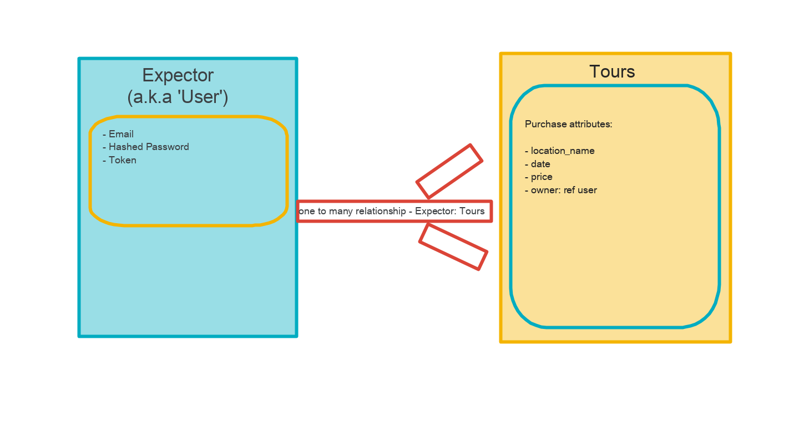
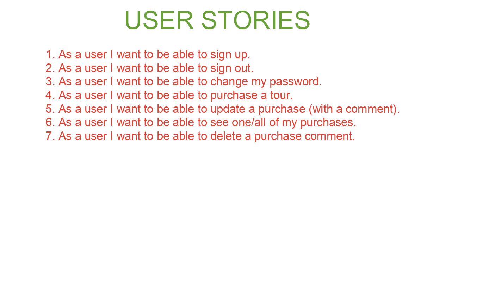

# Expect-Client: Description #
In a world where travel is drastically changing, Expect rises to the occasion to leverage the latest technology in order to increase on-demand virtual travel. Expect is a cutting-edge app that is engineered with React to provide users the ability to book a sight-seeing tour to a destination of choice.  No extensive packing, nor going through the rigmarole of booking a plane ticket and fighting TSA lines. Expect will take you to a sight you've never seen, or a sight you've been longing to revisit...all without the hassle!  Let's face it, travel is changing.  The way we see the world must evolve as well.  The Expect App will allow you to see the sights; from the Golden Gate Bridge to the Statue of Liberty, and you will see it on your time, with your very own contracted Expect tour guide.

### Tech used #

* MongoDB
* Mongoose
* HTML/CSS
* Javascript
* React-Bootstrap
* Axios

### API Documentation #
[Expect-Client-Deployed](https://callback-kings.github.io/expect-client/#/)

[Expect-Client-Repo](https://github.com/Callback-Kings/expect-client)

[Heroku Deployed](https://safe-dawn-20664.herokuapp.com/)

### Planning and Organization #
Planning was resourced by the use of morning scrum and a project Kanban board. Agile issues were opened on the team board, and they were assigned to team members to complete.  When a team member had an engineering challenge it would get posted to the project board. Challenges were handled competitively; we collectively worked on the same challenge and the member that engineered the best solution had their code implemented.

Organizational method of the project:

+ Set Up; ERD, wireframes, user stories
+ API User config
+ API route config
+ API testing/debug
+ Hard data to front-end
+ Component Builds
+ Axios requests from client to API testing
+ Implement Stripe
+ Inline styling
+ Debug
+ Final Touches

### Routes #

| METHOD    | Endpoint         | Component | `AuthenticatedRoute`? |
|------------|------------------|-------------------|-------|
| POST    | `/sign-up`       | `SignUp`    | No |
|   POST  | `/sign-in`       | `SignIn`    | No |
| PATCH    | `/change-password` | `ChangePassword`  | Yes |
| DELETE    | `/sign-out`        | `SignOut`   | Yes |

| METHOD    | Endpoint         | Component | `AuthenticatedRoute`? |
|------------|------------------|-------------------|-------|
| GET    | `/`       | `HOME`    | No |
| GET   | `/show-tours`       | `ShowTours`    | Yes|
| POST    | `/purchases/`        | `ShowPurchase`   | Yes |
| GET   | `/purchases` | `IndexPurchases`  | Yes |
| GET    | `/purchases/:id`        | `ShowPurchase`   | Yes |
| PATCH    | `/purchases/:id`        | `UpdatePurchase`   | Yes |
| DELETE    | `/purchases/:id`        | `UpdatePurchase`   | Yes |

### ERD #

### User Stories #

### Wireframes #

### Future Plans, Problems to solve #
Future versions are to have tours schema on the back end, and also a review schema, so that users can leave reviews about their experiences.  Further on, geolocation will be implemented to connect a sightseer to a tour guide via a video chat.
